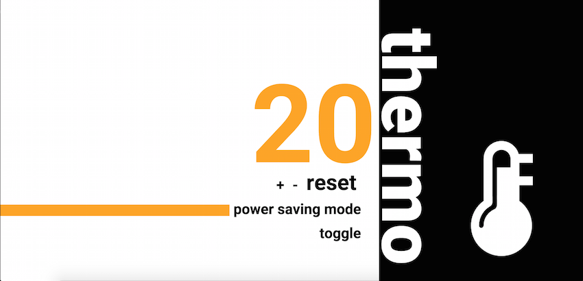
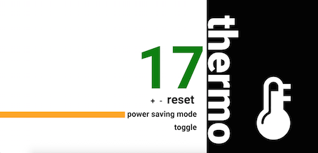

[](https://codeclimate.com/github/katebeavis/thermostat-express) [](https://travis-ci.org/katebeavis/thermostat-express)

Thermostat is a responsive thermometer that changes colour according to the temperature is it set at.

It has a range of temperatures from 10 - 32 and has the following set of rules applied to it:
- Starts at 20 degrees by default
- The gauge is coloured orange between temperatues of 18 - 24
- Turns red between temperatures 25 - 32
- Turns green between temperatures 10 - 17
- Has a powersaving mode that is on by default and limits the maximum temperature to 25

## Objectives
To understand jQuery and how it works in the DOM.

I really enjoyed this project as I felt we got to see just a little peek of how powerful Javascript can be when combined with jQuery. It's exciting to think of all the possibilities that it has, and how simple static websites can be transformed into dynamic ones with a few lines of code!

After I completed it, I decided to run it on an Express server so I could get a Travis build & host it on Heroku which was a great learning experience for me.

## Heroku & Screenshots
###[Thermostat Express](https://thermostat-express.herokuapp.com)
<div align="center">
  
</div>
<div align="center">
  
  
</div>


My design was based on that of one of my coaches, Roi Driscoll

## Technology
- Javascript
- jQuery
- jasmine-npm
- Express.js
- HTML
- CSS

## To Run
```
$ git clone https://github.com/katebeavis/thermostat-js.git
$ cd thermostat-js
$ npm install
$ node server.js
visit http://localhost:3000
```

## To Run Tests
```
$ jasmine
```
